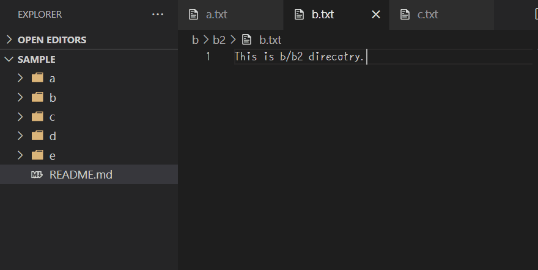
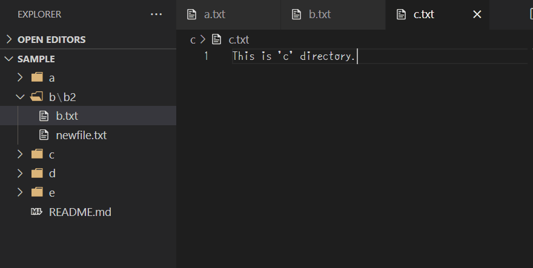

# Reveal Util

Provides utility commands for users who have `Explorer: Auto Reaval` (`explorer.autoReveal`) option set to false.

## Features

### Focus Explorer

- command: `reveal-util.showActiveFileInExplorer`

Focus the file of the current active editor in Explorer view.

This is an alias of the command `workbench.files.action.showActiveFileInExplorer`.

### New File

- command: `reveal-util.newFile`

Create a new file in the parent direcotry of the current active editor.

If you want to set key bindings for this command, put `editorTextFocus` in the `when` expression.

### New Folder

- command: `reveal-util.newFolder`

Create a new folder in the parent direcotry of the current active editor.

If you want to set key bindings for this command, put `editorTextFocus` in the `when` expression.

## Extension Settings

No settings.

## Release Notes

### 1.0.1

- Fix keybinding command

### 1.0.0

Initial release
